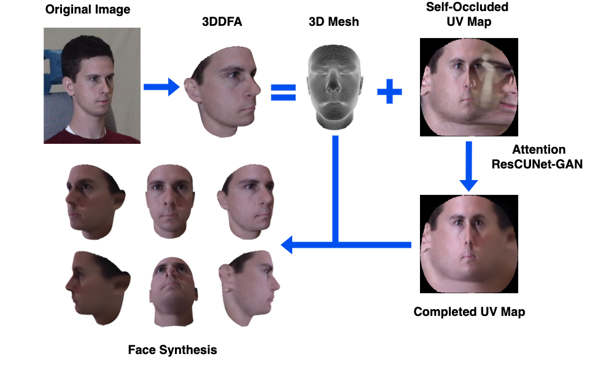
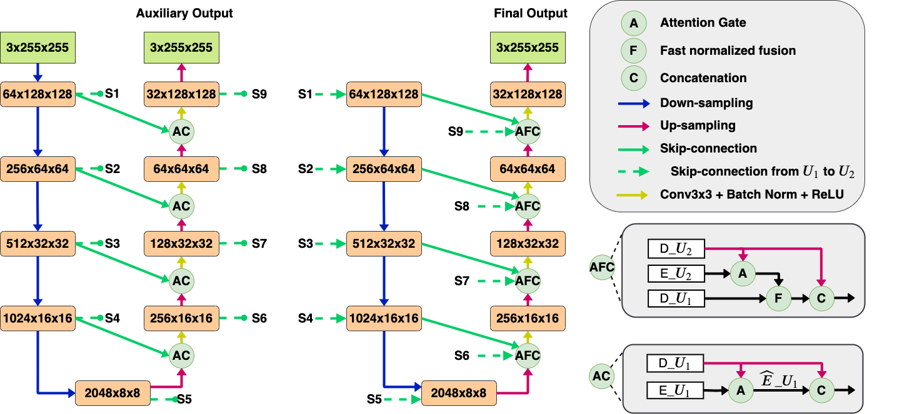

# AttentionResCUNet
We will update the code as soon as possible

>Abstract
Pose-invariant face recognition refers to the problem of identifying or verifying a person by analyzing face images captured from different poses. This problem is challenging due to large variation of pose, illumination, expression. A promising approach to deal with pose variation is to fulfill incomplete UV maps extracted from in-the-wild faces, then attach the completed UV map to a fitted 3D mesh and finally generate different 2D faces of arbitrary poses. The synthesized faces can increase pose variation for training deep face recognition models and reduce pose discrepancy during testing phase. In this paper, we propose a novel generative model called Attention ResCUNet-GAN to improve UV map completion. We enhance the original UV-GAN by using a couple of U-Nets. Particularly, the skip connections within each U-Net are boosted by attention gates, meanwhile the features from two U-Nets are fused with trainable scalar weights. The experiments on the popular benchmarks shows that our method yields superior performance compared to the original UV-GAN model.

------
<figure>
  
  <figcaption>Figure 1. A pipeline process of making synthetic pose. Using 3DDFA to obtain a 3D mesh and an incomplete UV map. Then a new generative model is applied to recover the self-occluded regions. The completed UV map is attached to the fitted 3D mesh to generate faces of arbitrary poses.</figcaption>
</figure>

------
<figure>
  
  <figcaption>Figure 2. Generator architecture. The generator of proposed Attention ResCUNet-GAN consists of coupled U-Nets. Skip connections within each U-Net are enhanced with attention gates before concatenation. The contextual information from the first U-Net decoder is weighted fused with attentive low-level feature maps of the second U-Net encoder before concatenation with the high-level coarse feature maps of the second U-Net decoder. An auxiliary loss is used to improve gradient flow during training phase.</figcaption>
</figure>

------
<figure>
  
  <figcaption>Figure 3. Results with frontal input images. Incomplete UV maps are generated using 3DDFA. Next columns are ground truth UV maps, results of UV-GAN, results of normal ResCUNet-GAN, intermediate results of Attention ResCUNet-GAN (after the first U-Net) and final results of Attention ResCUNet-GAN (after the second U-Net), respectively. The most right block shows some synthetic images generated based on the final results of Attention ResCUNet-GAN.</figcaption>
</figure>

------
<figure>
  
  <figcaption>Figure 4. Results with profile input images. Incomplete UV maps are generated using 3DDFA. Next columns are ground truth UV maps, results of UV-GAN, results of normal ResCUNet-GAN, intermediate results of Attention ResCUNet-GAN (after the first U-Net) and final results of Attention ResCUNet-GAN (after the second U-Net), respectively. The most right block shows some synthetic images generated based on the final results of Attention ResCUNet-GAN.</figcaption>
</figure>

------
<figure>
  
  <figcaption>Figure 5. Results with in-the-wild input images. Incomplete UV maps are generated using 3DDFA. The ground truth UV maps are unavailable. The next columns are the results of UV-GAN, results of normal ResCUNet-GAN, intermediate results of Attention ResCUNet-GAN (after the first U-Net) and final results of Attention ResCUNet-GAN (after the second U-Net), respectively. The right block shows some synthetic images generated based on the final results of Attention ResCUNet-GAN.</figcaption>
</figure>

**Author**  
Chung Tran Quang: Hanoi University of Science and Technology  
Sang Dinh Viet: Hanoi University of Science and Technology  
**Contact**  
If you have any question, please contact me via email: *bktranquangchung@gmail*.